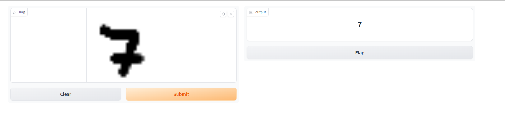

# Reconocimiento de Dígitos Escritos a Mano con Redes Neuronales Convolucionales y Gradio

Este proyecto es una introducción práctica al uso de Redes Neuronales Convolucionales (CNNs) para el reconocimiento de dígitos escritos a mano. Utilizamos el popular conjunto de datos MNIST, TensorFlow para construir la red neuronal y Gradio para desarrollar una interfaz de usuario interactiva.

 

## Contenido
- [Descripción General](#descripción-general)
- [Tecnologías Utilizadas](#tecnologías-utilizadas)
- [Cómo Empezar](#cómo-empezar)
- [Uso](#uso)
- [Contribuir](#contribuir)
- [Licencia](#licencia)

## Descripción General

El conjunto de datos MNIST contiene 60,000 imágenes de entrenamiento y 10,000 imágenes de prueba de dígitos escritos a mano en escala de grises (28x28 píxeles). El objetivo es construir un modelo de aprendizaje profundo que pueda identificar correctamente estos dígitos. 

Este proyecto incluye la construcción de una Red Neuronal Convolucional utilizando TensorFlow. Las CNNs son particularmente efectivas para tareas de clasificación de imágenes debido a su capacidad para capturar características espaciales.

Además, para que sea más interactivo y amigable para el usuario, hemos desarrollado una interfaz de usuario web simple utilizando Gradio. Esto permite a los usuarios dibujar un dígito y obtener las predicciones del modelo en tiempo real.

## Tecnologías Utilizadas

- **TensorFlow**: Un marco de aprendizaje profundo que nos permite construir y entrenar redes neuronales.
- **Gradio**: Una biblioteca para crear rápidamente interfaces de usuario para modelos de aprendizaje automático.
- **MNIST Dataset**: Un conjunto de datos de imágenes en escala de grises de dígitos escritos a mano, utilizado para entrenar y evaluar el modelo.

## Cómo Empezar

Para ejecutar este proyecto en tu máquina local, sigue estos pasos:

1. Asegúrate de tener Python 3.6 o superior instalado.
2. Clona este repositorio:

    ```sh
    git clone https://github.com/demstalferez/Reconomiento-de-digitos-con-red-neuronal.git
    ```

3. Navega al directorio clonado e instala las dependencias requeridas:

    ```sh
    cd Reconocimiento-de-Digitos-Escritos-a-Mano
    pip install -r requirements.txt
    ```

## Uso

1. Ejecuta el script `app.py`:

    ```sh
    python3 app.py
    ```

2. Esto abrirá una ventana en tu navegador web. Puedes dibujar un dígito en el cuadro proporcionado y luego presionar el botón de enviar para ver la predicción del modelo.

## Contribuir

Si deseas contribuir a este proyecto, por favor:

1. Haz un Fork del repositorio.
2. Crea tu rama de características (`git checkout -b feature/nombre-de-tu-feature`).
3. Realiza tus cambios y haz commit de ellos (`git commit -am 'Añadir alguna característica'`).
4. Sube tu rama (`git push origin feature/nombre-de-tu-feature`).
5. Crea un nuevo Pull Request explicando tus cambios.

## Licencia

Este proyecto está bajo la Licencia MIT - consulta el archivo [LICENCIA](LICENCIA) para más detalles.

